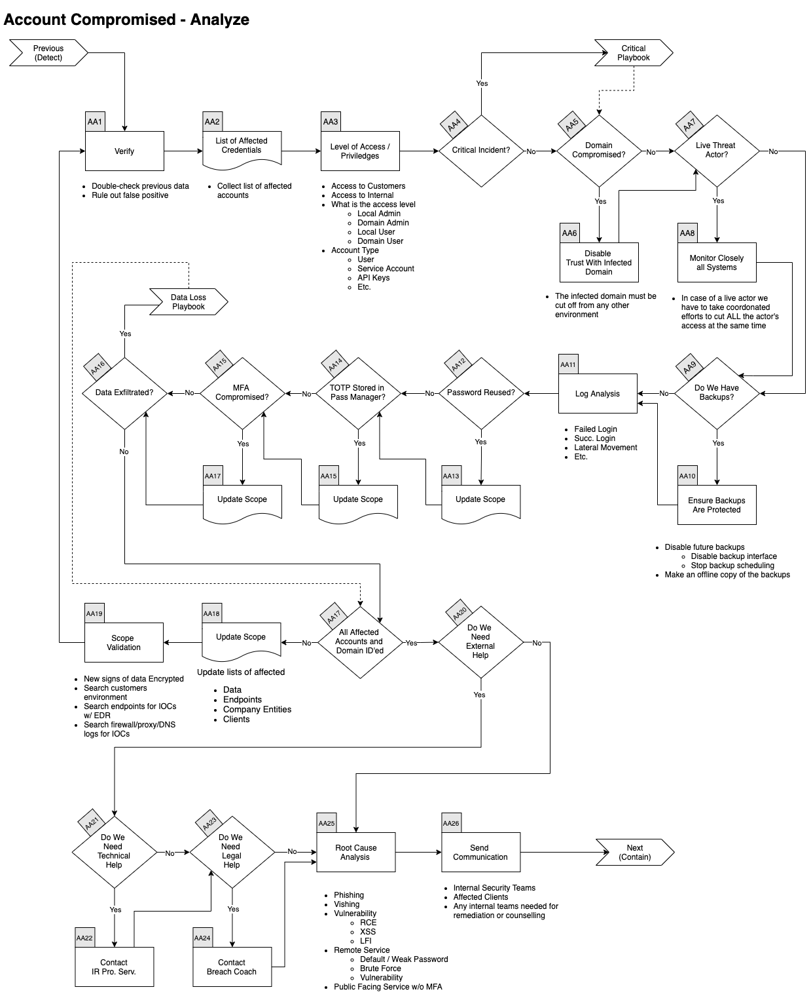
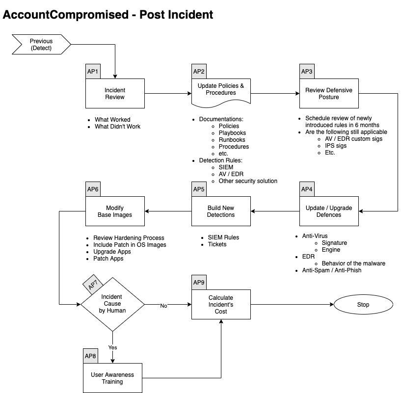

# Account Compromised Playbook

## Scope
Dit draaiboek beschrijft de stappen die moeten worden genomen wanneer accounts zijn gecompromitteerd. Natuurlijk moeten we ook de hosts waar deze accounts zijn gebruikt, herstellen. 

## 1. Voorbereiding

Expand/Colapse

- Maak en onderhoud een lijst van:
    - alle domeinen die eigendom zijn van het bedrijf.
        - Dit kan voorkomen dat je acties onderneemt tegen onze eigen domeinen.
    - alle mensen die domeinen kunnen registreren.
- Maak e-mailsjablonen:
    - om alle medewerkers te informeren over lopende phishingcampagnes tegen de organisatie.
    - om hostingbedrijven te contacteren voor het neerhalen van domein(en).
    - om derden te informeren om actie te ondernemen tegen phishing op hun infrastructuur (Microsoft, Fedex, Apple, enz.).
- Zorg ervoor dat:
    - Mail anti-malware/anti-spam/anti-phish oplossingen aanwezig zijn.
    - Gebruikers weten hoe ze phishing kunnen melden.
    - Detectie bestaat voor Office-documenten die processen starten.
        - PowerShell
        - CMD
        - WMI
        - MSHTA
        - Etc.
- Voer een oefening uit om ervoor te zorgen dat alle aspecten van het draaiboek werken:
    - Na publicatie.
    - Minstens één keer per jaar.
    - Test/Valideer:
        - Interne contact- en escalatiepaden.
- Beoordeel dreigingsinformatie voor:
    - bedreigingen voor de organisatie,
    - merken en de sector,
    - gemeenschappelijke patronen,
    - nieuw ontwikkelende risico's en kwetsbaarheden.
- Zorg voor de juiste toegang tot alle benodigde documentatie en informatie, inclusief toegang buiten kantooruren, voor de volgende:
    - IR Draaiboeken.
    - Netwerkarchitectuurdiagram.
    - Gegevensstroom.
    - Identificeer en verkrijg de diensten van een derde partij Cyber Forensic provider.
- Definieer dreigings- en risicofactoren en waarschuwingspatronen binnen de beveiligingsinformatie- en gebeurtenisbeheer (SIEM) oplossing van de organisatie.

### Train Medewerkers
- Voer regelmatig bewustwordingscampagnes uit om de informatiebeveiligingsrisico's voor medewerkers te benadrukken, waaronder:
    - Phishing-aanvallen en kwaadaardige e-mails;
    - Ransomware;
    - Het melden van een vermoedelijk cyberincident.
### Toegang tot en voorziening van tools

### Tool1
(../Products/TOOL.md)

### Tool2
(../Products/TOOL.md)

### Lijst van activa
- Er moet een lijst van activa en eigenaren bestaan en beschikbaar zijn voor de volgende:
    - Klantenactiva
    - Eigenaren
    - Contacten
    - Vooraf geautoriseerde acties
- Bedrijfsactiva (inclusief alle filialen en bedrijfseenheden)
    - Eigenaren
    - Contacten
    - Beheerders
- Vooraf geautoriseerde acties
    - Type activa-inventaris die nodig is:
    - Eindpunten
    - Servers
    - Netwerkapparatuur
    - Beveiligingsapparaten
    - Netwerkbereiken
        - Publiek
        - Privé
        - VPN / Out of Band
            - Medewerkers
            - Partners
            - Klanten

## 2. Detecteren

Expand/Colapse

### Workflow

Expand/Colapse

### Identify Threat Indicators

Expand/Colapse

#### Alerts
Waarschuwingen worden gegenereerd door verschillende systemen die eigendom zijn van het Security/SOC-team. De belangrijkste bronnen voor waarschuwingen zijn:
    - Tickets
    - SIEM
    - Anti-Virus / EDR
    - Rapporten
    - DNS
    - Fouten van mailservers

#### Meldingen
Meldingen komen van externe bronnen, meestal via e-mail, Teams of telefoon. De belangrijkste bronnen voor meldingen zijn:

- Gebruikers (intern)
- Ontvangers van e-mails (extern)
- Derden
- ISP
- Mailproviders

### Indentify Risks Factors

Expand/Colapse

#### Algemeen
- Diefstal van inloggegevens
- Malwarelevering
- Criminele activiteiten
- Chantage / Losgeld

#### Bedrijfsspecifiek
- Financiële verliezen
    - Verlies van contract
    - Contract niet verlengd
    - Lagere bieding aan onze klanten
    - Boetes
        - Regelgeving

### Data Colletion
Deze sectie beschrijft de informatie die moet worden verzameld en gedocumenteerd over het incident. Er zijn veel bronnen om je te helpen met die fase [here](../Tools/README.md)

Expand/Colapse

Domeinen
- Reputatie
- Registrar
- Eigenaar
- IP
- Meerstaps / Doorverwijzing
- Technologieën van de site 
- Drupal
- Aangepaste pagina (inloggegevens phished)

IP
- Reputatie
- Eigenaar
- Geolocatie
- Andere domeinen op dat IP

</detials>

### Categoriseren

Expand/Colapse

Bepaal het type

### Triage 

Expand/Colapse

Bepaal
- Impact
- Van
- Financieel
- Gegevensverlies
- Omvang (Aantal mensen)

## 3. Analyse

Expand/Colapse

### Workflow

Expand/Colapse

### AA1. Verifiëren

Expand/Colapse

In samenwerking met een senior lid van het SOC
- Dubbelcheck eerdere gegevens
- Sluit valse positieven uit

### AA2. Lijst van Gecompromitteerde Inloggegevens

Expand/Colapse

In het tabblad Gecompromitteerde Activa van het logboek van gebeurtenissen:
- Gecompromitteerde accounts
- Gecompromitteerde machines
- Gecompromitteerde domeinen

### AA3. Niveau van Toegang / Privileges

Expand/Colapse

In samenwerking met een senior lid van het SOC
- Dubbelcheck eerdere gegevens
- Sluit valse positieven uit

### Update Scope

Expand/Colapse

- Update lijsten van
    - getroffen eindpunten
    - getroffen bedrijfsentiteiten
    - getroffen klanten

### Scope Validation

Expand/Colapse

Zijn alle machines geïdentificeerd? Als je verdere sporen van phishing of nieuwe IOC's vindt, ga dan terug naar deze stap.

Wanneer je klaar bent met het identificeren van alle gecompromitteerde:
- Hosts

En alle hebt onderzocht:
- URL's
- Domeinen
- IP
- Poorten
- Bestanden
- Hash
Ga naar de volgende fase <Contain/Eradicate>

## 4. Contain / Eradicate

Expand/Colapse

### Workflow

Expand/Colapse

### Block

Expand/Colapse

- Update FW, Proxy, etc. regels
- Blackhole DNS
- Indienen bij Partners
    - AV/EDR Leverancier
    - Webfilter Leverancier
    - etc.

### Gebruikersacties Valideren

Expand/Colapse

### Malware Infectie?

Expand/Colapse

Als er kwaadaardige bijlagen waren die werden geopend, moeten we aannemen dat de eindpunten zijn geïnfecteerd door malware. [Malware Playbook](../IRP-Malware/README.md)  

### Nauwlettend Toezicht

Expand/Colapse

- Monitor voor
    - Gerelateerde inkomende berichten
    - Internetverbindingen naar IOC
    - Nieuwe bestanden die overeenkomen met geïdentificeerde hashes

### Zijn alle Endpoints Contained?

Expand/Colapse

Als alle getroffen eindpunten zijn bevat, kun je naar de volgende fase gaan, anders ga je hieronder verder. 

### Nieuwe IOC Ontdekt?

Expand/Colapse

Als er een nieuwe IOC is ontdekt, ga dan terug naar de [Analyze Phase](README.md#3-analyze)

## 5. Herstellen

Expand/Colapse

### Workflow

Expand/Colapse

### Update Defenses

Expand/Colapse

Determine which of the following rules needs to be removed and which needs to stay in the following list:  
- Firewall Regels
- EDR
    - hashes verbannen
    - domeinen verbannen
    - containement

### Alle Getroffen Eindpunten Hersteld?

Expand/Colapse

Als alle getroffen eindpunten zijn contained, kun je naar de volgende fase gaan, anders ga je hieronder verder. 

### Validate Countermeasures

Expand/Colapse

Bepaal of legitieme elementen worden geblokkeerd door:
- Firewall
- EDR
Als dat zo is, ga dan terug naar [Update Defenses](README.md#update-defenses)
Anders ga je naar de volgende fase <Post Incident>

## 6. Na Incident

Expand/Colapse

### Workflow

Expand/Colapse

### Incident Review

Expand/Colapse

- Wat werkte
- Wat werkte niet

### Wijziging van Werkwijze

Expand/Colapse

Werk de volgende documenten bij indien nodig:
- Beleid
- Processen
- Procedures
- Playbooks
- Runbooks

Update Detectieregels in:
- SIEM
- Anti-Spam
- Malware Gateway
- EDR
- Andere beveiligingsoplossingen

### Review Defensive Houding

Expand/Colapse

- Plan beoordeling van nieuw geïntroduceerde regels over 6 maanden
- Zijn de volgende nog steeds van toepassing
    - Firewall Regels
    - AV / EDR aangepaste Handtekeningen
    - IPS Handtekeningen

### Gebruikersbewustzijnstraining

Expand/Colapse

- Phished

 
