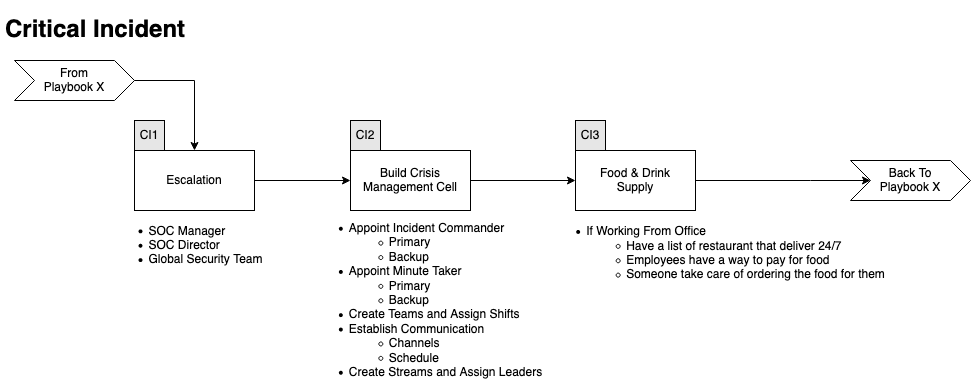

# Critical Incident Playbook
Hier zijn de stappen die moeten worden genomen wanneer een incident als kritiek wordt beschouwd.
Het feit dat het incident kritiek is, betekent niet dat het Playbook kan/moet worden genegeerd. Het betekent alleen dat elke stap sneller moet plaatsvinden, dat meer mensen aan het incident zullen werken en dat er een Incident Commander zal worden aangesteld. 

## Workflow

Expand/Colapse

## CI1 - Bouw een Crisis Management Cel

Expand/Colapse

De SOC Manager en CEO zullen:
- Een Incident Commander en een backup aanstellen
    - Verantwoordelijk om de beslissingen te nemen
    - Zorgen dat de Playbooks worden gevolgd
        - Geen stappen worden vergeten
        - Stappen worden in de juiste volgorde genomen
            - Dit betekent niet dat veel stappen niet gelijktijdig kunnen worden genomen
        - De keten van bewaring wordt gehandhaafd
    - Er is altijd iemand die aantekeningen maakt
    - Sleutelfiguur om alle informatie te verzamelen
    - Kan acties autoriseren
        - MPLS loskoppelen
        - Diensten/computer uitschakelen
    - Kan uitgaven autoriseren
        - Apparatuur
        - VM
            - GCP
            - AZURE
    - Software
- Een "notulist" en een backup aanstellen
- Creëer
    - Alpha Team
    - Beta Team
    - Charlie Team
- Communicatieschema opstellen
    - Stream Report
    - C Level communicatie
    - enz.
Het doel van deze teams is om:
- Mensen 24/7 aan het incident te laten werken
- Mensen de kans te geven om te rusten
- Tijd te hebben voor overdracht
    - Minstens 1 uur (2 voorkeur)
    - Beide teams werken samen
    - Alle updates worden gegeven
Elk van de teams moet:
- Stream Leads hebben
    - Log review Stream
        - Diepte en breedte van de aanval
- Kwetsbaarheidsbeoordeling
    - Proberen de oorzaak te achterhalen
    - Kijken of andere systemen dezelfde kwetsbaarheid hebben
- Forensische Stream
    - Begrijpen wat er op de host(s) is gebeurd
    - Malware-analyse
    - IOC identificeren
    - De Log Stream voeden
- Host Stream
    - Beveiligingsoplossing implementeren
    - Beveiligingsoplossing bijwerken
    - Nieuwe server bouwen
    - Apps installeren
    - Gegevens herstellen
    - enz.
- Dark Web / Social Media monitoring Stream (optioneel)
    - Is er enige discussie over de inbreuk
    - Worden de gegevens te koop aangeboden
    - Zijn de gegevens ergens gepost

## CI2 - Voedsel- en drankvoorziening
Als je vanuit kantoor werkt, moeten we weten hoe we ons personeel zullen voeden. Iemand moet een lijst hebben van restaurants die 24/7 naar onze locaties bezorgen. We willen niet dat ons team drie keer per dag gefrituurde kip of pizza eet.

## CI3 - Communicatieschema definiëren
Tijdens een kritiek incident is het delen van informatie cruciaal. We moeten ervoor zorgen dat iedereen weet waar en wanneer informatie moet worden gerapporteerd.
Definieer het volgende:
- Wie zal elke oproep bijwonen
- Welk platform zal worden gebruikt om te communiceren
- Technische oproep om informatie tussen de Streams te synchroniseren
- C-Level informatie oproep
- Klanteninformatie oproep

## CI4 - Terug naar het Playbook
Zodra de rollen en teams zijn gevormd, stuur het team dat het overneemt weg zodat ze kunnen rusten en klaar zijn om het over te nemen. Keer ten slotte terug naar de oorspronkelijke Playbook(s).

Veel succes!
 
